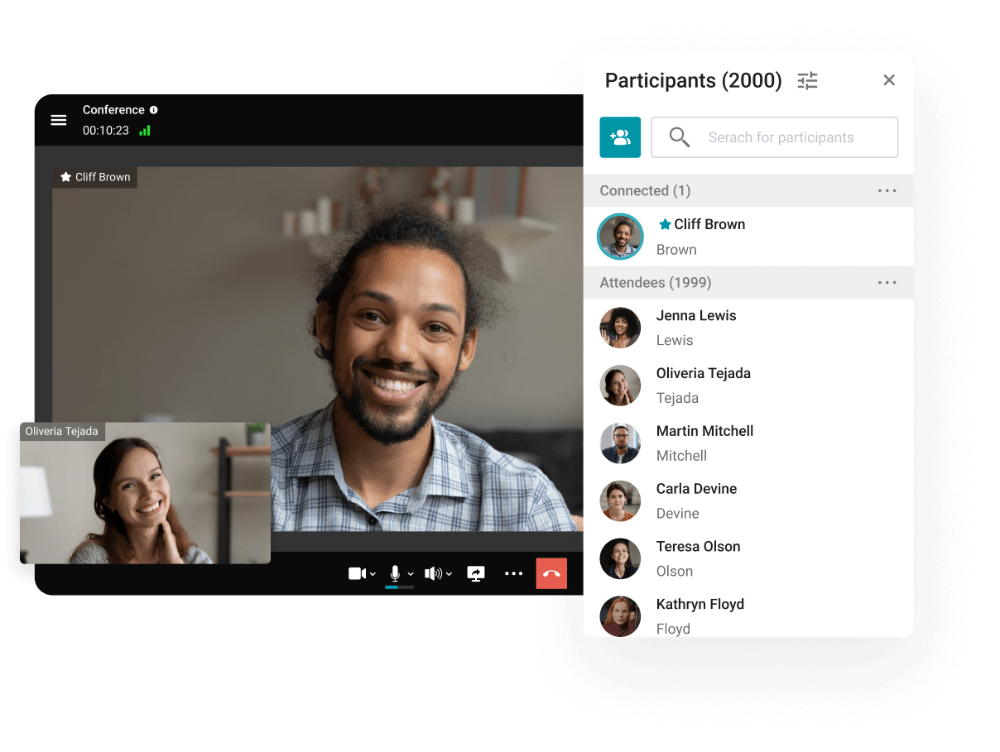
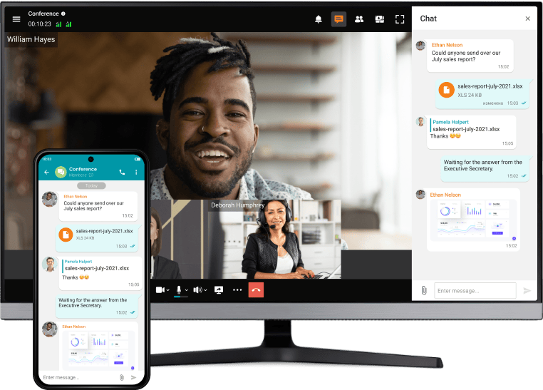
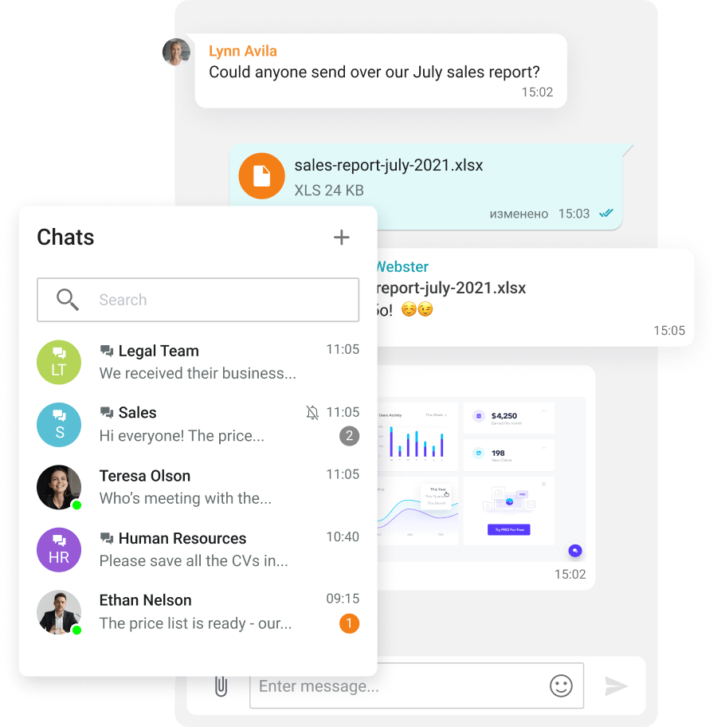
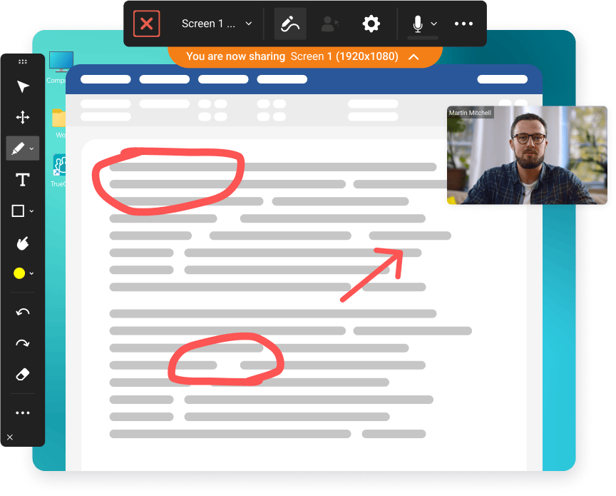
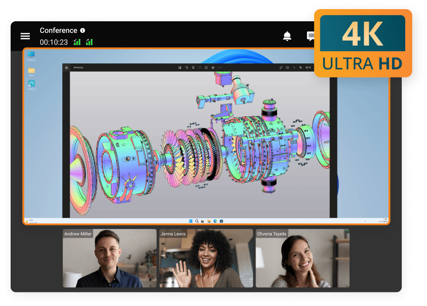
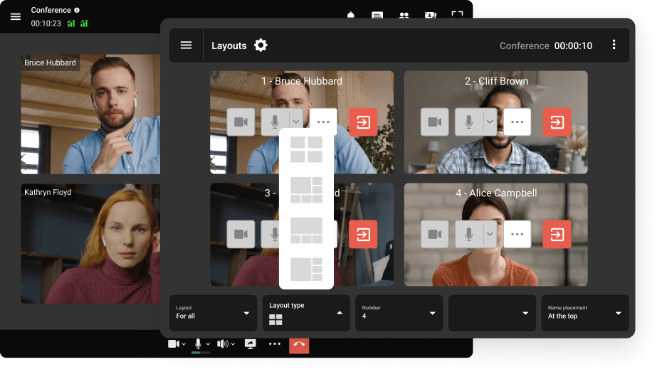
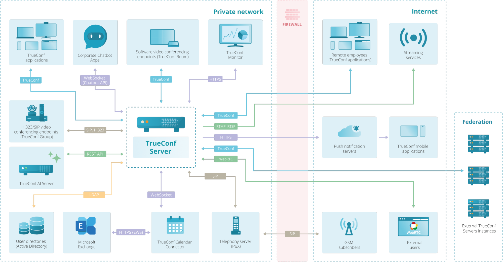
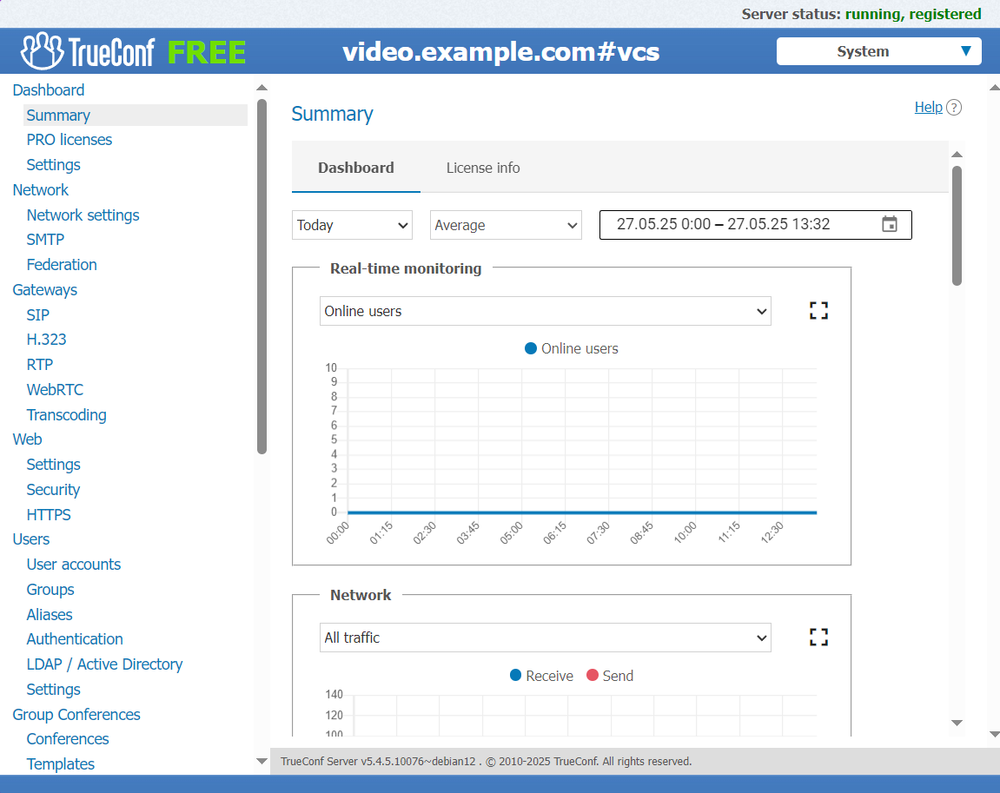

## TrueConf Server Free: Secure Video Conferencing System and Corporate Messenger for 1000 Users

### Description

TrueConf Server Free is an all-in-one corporate communications platform with a built-in messenger, video conferencing, and collaboration tools.

### Features

TrueConf Server Free offers the following features:

* Support for native client applications on all popular operating systems, including mobile devices. 
* 4K video conferences.
* **Up to 1,000 chat participants**.
* Collaboration tools (content sharing, screen annotation, slideshow).
* Private and group chats.
* Address book and presence statuses.
* Secure file storage.
* Call history and chat syncing across all devices.
* LDAP integration.

#### Video conferencing

Schedule meetings or escalate your chats into video conferences on the fly, create events with up to 2000 participants.

Take full advantage of AI features:

* Noise suppression.
* Background blurring and virtual backgrounds.
* Conference branding.
* Meeting transcription (*integration with TrueConf AI Server is needed*).

Feel free to receive calls and participate in conferences on any device — chat history will be synced automatically.

Join online meetings on TrueConf Server Free using a browser and an invitation link.

#### Corporate messenger

In addition to the core features, private and group chats support text formatting which helps you to highlight important points.

Use keyboard shortcuts and drag-and-drop for quick chat interaction. Besides, the built-in viewer will make it much easier to work with media content.

Mention group chat participants to draw their attention to your message.

#### Collaboration without borders

TrueConf application offers a wide range of collaboration tools. 

Ability to share different types of content: 

* Desktop.
* Individual screen (if multiple monitors are available).
* Individual application windows (including CAD models or presentations).
* Slideshows.

You can stream audio separately or while sharing any type of content.

#### Share content in high quality

Share content in 4K UltraHD during online meetings! Show high-definition CAD models, spreadsheets, and presentations created in third-party apps.

#### Flexible conference management

Manage devices and adjust participants’ layouts in two clicks depending on the meeting scenario.

### TrueConf Server workflow

The following diagram shows how TrueConf Server interacts with other TrueConf solutions and third-party services (some integrations are not available in the Free version, more details are given below):

### Comparison of TrueConf Server Free and TrueConf Server 

|<!-- -->  |TrueConf Server Free | TrueConf Server |
|:---------|:-------------------:|:---------------:|
| Group video conferences, moderated role-based conferences, and online lessons in 4K UltraHD quality. | Up to 10 participants in one conference | Up to 2000 participants in one or several conferences depending on the terms of your license.  |
| Audio and video calls between two users in 4K UltraHD quality. | Up to 1000 users  | V |
| Private and group chats, file sharing, and secure data storage. | Up to 1000 users    | V |
| Slideshow, content sharing, polling, reactions, and much more. | V | V |
| Client applications for all platforms: Windows, Linux, macOS, iOS, Android, and Android TV. | V | V |
| Ability to sign in and work on multiple devices. | V | V |
| Presence statuses which show whether users are currently available and what type of device they have.  | V | V |
| Ability to schedule conferences in the calendar.  | V | V |
| Recording video conferences locally in client applications and centrally on the server side. | V | V |
| Management of integrations, accounts, groups and their permissions, ability to schedule, record, and manage conferences in the built-in web interface.  | V | V |
| No limit on the number of accounts. | V | V |
| Works through NAT, Firewall, and Proxy. No need to use a public IP address or open an additional port.  | V | V |
| Stable performance on weak channels and devices. Сall quality will be automatically adjusted depending on changing connection conditions and endpoint devices. | V | V |
| Full compatibility with classic hardware endpoints thanks to the built-in SIP/H.323 gateway. | One connection. | V |
| Invitations to conferences for mobile devices and landline phone users, integration with VoIP telephony and PBXs. | V | V |
| Web conferences that can be joined from a browser. Fully-featured browser-based  communication without plugin installation thanks to WebRTC support. | 1 guest connection.  | V |
| Installation within the corporate LAN/VPN network. | V | V |
| Connection to Zoom ®, Cisco Webex, GoToMeeting, and Skype for Business conferences. | V | V |
| Integration with LDAP directories (e.g., Active Directory), user information synchronization, single sign-on (SSO) for all users of the video conferencing server. | V | V |
| TrueConf Server API, video communication integration with third-party solutions, services, and automation tools. | V | V |
| TrueConf SDK. Integration of video communication into third-party applications. | X | V |
| Manual distribution of PRO licenses. | X | V |
| Autonomy. There is no need for the video conferencing server to be constantly connected to the Internet.  | X | V |
| Conference streaming. Stream your conferences to third-party services and solutions (YouTube, Wowze, etc.) to reach any audience.   | X | V |
| Federation support, communication with the  users of TrueConf Server instances installed by other customers. | X | V |
| Support for UDP Multicast, video conferences and data exchange via satellite networks which helps to reduce the load on the video conferencing server. | X | V |
| Guaranteed technical support. | X | V |

### Installation on Windows

To install TrueConf Server on Windows:

* [Fill out the form](https://trueconf.com/downloads/trueconf-server/).  
* Go to the **Windows** tab and click the **Download TrueConf Server** button, or download the file via the [direct link](https://trueconf.com/download/server/windows/trueconf_server_setup.exe).  
* After downloading the distribution, launch it to start installation.  
* When installation is complete, activate TrueConf Server with the registration key. The key will be sent to the email specified in the registration form.  
* After successful registration, the server will start working and display the corresponding status in the control panel.

### Installation on other operating systems

Distributions for other operating systems (Linux family), Docker, and installation guides can be found in the following articles:

* [How to install TrueConf Server on Linux-based operating systems](https://trueconf.com/blog/knowledge-base/install-and-set-up-your-video-conferencing-server-for-linux-in-15-minutes).
* [How to install TrueConf Server in a Docker container](https://trueconf.com/blog/knowledge-base/how-to-run-trueconf-server-in-a-docker-container).